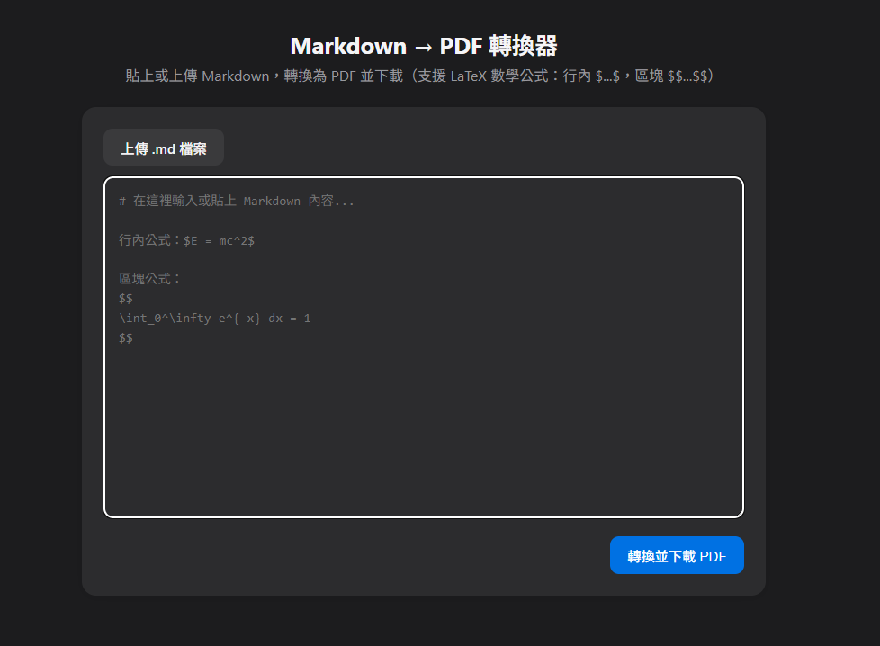

# Markdown to PDF Converter

Was made for AIS3 Junior 2026

## Features

* Support LaTeX symbols
* Upload file or paste your Markdown
* Customize the exported PDF filename (including Chinese names)
* Batch export up to 50 Markdown files as a ZIP archive
* Batch filenames support numeric or alphabetic sequences, starting numbers, zero padding, and custom templates
* HTTP API for Markdown file uploads or JSON conversion, with direct PDF downloads
* Interactive Swagger API documentation and an OpenAPI specification

## API

After starting with Docker Compose, open [API docs](http://localhost:8008/api-docs/) to view the API and try uploading a file. `/api-doc` redirects to the same page. The OpenAPI 3.0 specification is available at `/api/openapi.json`. When running `npm start` locally, use port `3000` instead of `8008`.

`POST /api/convert` returns PDF bytes with `Content-Type: application/pdf` and `Content-Disposition: attachment`. No API key is required.

Upload a UTF-8 `.md` or `.markdown` file using `multipart/form-data`:

```sh
curl --fail-with-body http://localhost:8008/api/convert \
  -F 'file=@example.md' \
  -F 'filename=報告.pdf' \
  --output report.pdf
```

| Field | Required | Description |
| --- | --- | --- |
| `file` | Yes | One UTF-8 `.md` or `.markdown` file, up to 10 MiB (10,485,760 bytes). |
| `filename` | No | Download name, up to 200 UTF-8 bytes. Defaults to the uploaded file's name with `.pdf` replacing its extension. |

Do not manually set the multipart `Content-Type`; your HTTP client supplies the boundary. Only `file` and the optional `filename` field are accepted. A `.pdf` extension is added automatically, and invalid filename characters are replaced with underscores.

You can also send JSON (up to 10 MiB for the entire JSON body):

```sh
curl --fail-with-body http://localhost:8008/api/convert \
  -H 'Content-Type: application/json' \
  --data '{"markdown":"# Hello\n\nMarkdown to PDF via API.","filename":"report.pdf"}' \
  --output report.pdf
```

JSON requires a non-blank `markdown` string. `filename` is optional and defaults to `document.pdf`. The existing `/convert` (single PDF) and `/convert-batch` (ZIP) JSON endpoints continue to work.

Errors return JSON in the form `{"error":"message"}`:

| Status | Meaning |
| --- | --- |
| `400` | Missing or empty Markdown, invalid extension/UTF-8, invalid upload fields or filename, or malformed JSON/multipart. |
| `413` | Markdown upload or JSON body exceeds 10 MiB. |
| `415` | Unsupported Content-Type, content encoding, or charset. |
| `500` | PDF conversion failed. |

`npm test` runs HTTP API, validation, documentation, and existing export compatibility checks without launching a browser. To also test an actual upload through the PDF renderer, run `RUN_PDF_SMOKE_TEST=1 npm test` with Chromium installed; set `PUPPETEER_EXECUTABLE_PATH` if needed. Docker includes Chromium and CJK fonts.

## Export filenames

For a single PDF, enter the filename below the editor. The `.pdf` extension is added automatically.

For batch exports, select multiple Markdown files and set a common name. Files are numbered in the order shown in the preview. Use `{name}` for the common name and `{index}` for the sequence in the filename format.

Examples:

* `{name}_{index}` with name `report` and 3-digit numbers: `report_001.pdf`, `report_002.pdf`
* `{name}-{index}` with uppercase letters: `report-A.pdf`, `report-B.pdf`
* `第{index}份_{name}` with name `報告`: `第01份_報告.pdf`

Alphabetic sequences continue from Z to AA (or z to aa). The starting number 1 means A; 27 means AA. Batch downloads include all PDFs in one ZIP. The total request size is limited to 10 MB.

Run API and export compatibility checks with `npm test`.

## Install

Just do this.

```
docker compose up -d
```

## Demo

[Website]("https://md-to-pdf.yoyo899843.com")


## Project structure

* `server.js`: starts the HTTP server.
* `src/app.js`: configures Express and serves the frontend.
* `src/routes/convert.js`: single and batch export endpoints and request validation.
* `src/middleware/upload.js`: multipart upload parsing and validation.
* `src/openapi.js`: OpenAPI specification served at `/api/openapi.json` and rendered by Swagger UI at `/api-docs/`.
* `src/services/`: Markdown-to-PDF rendering and ZIP packaging.
* `public/index.html` / `public/styles.css`: page markup and styling.
* `public/js/`: frontend initialization, single and batch export interactions, shared downloads, and filename rules (also reused by the backend).
* `test/`: HTTP API, validation, docs, export compatibility, and optional real-renderer checks.
